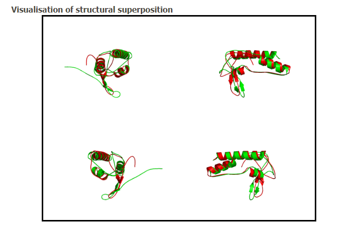
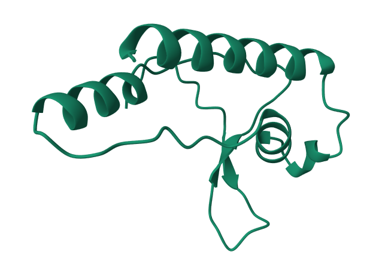
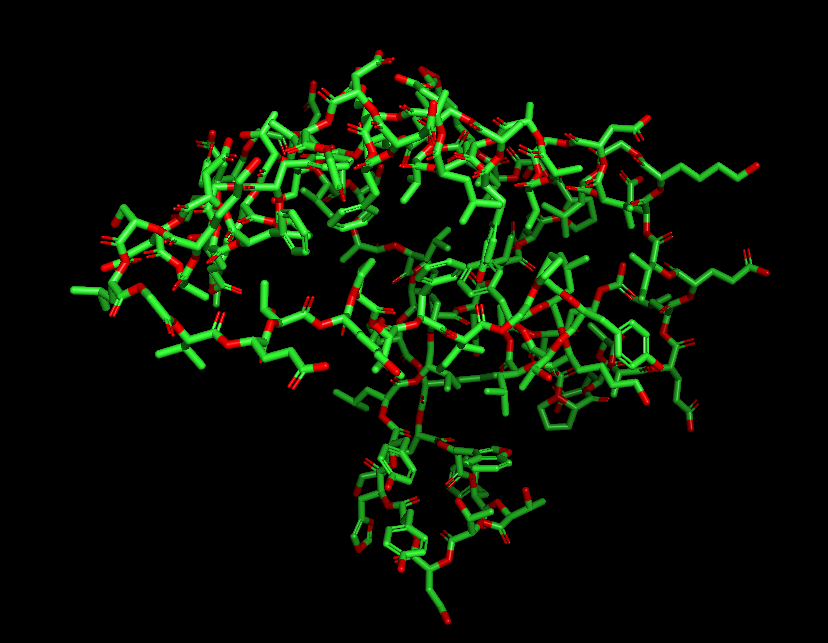
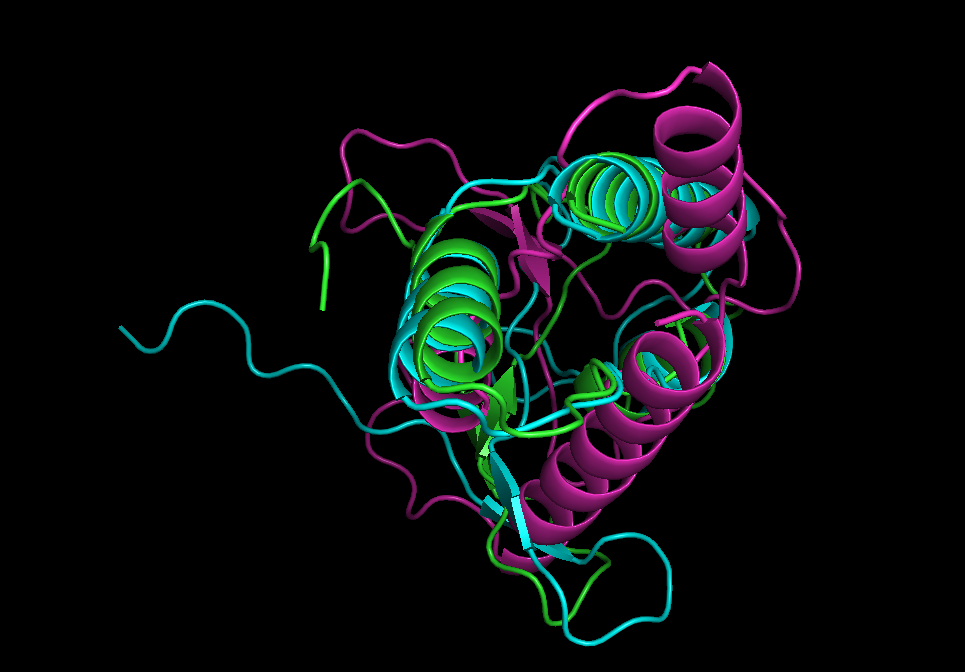
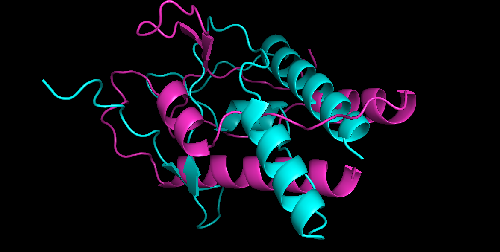

1. **Последовательность, названия программ-предсказателей и программы-выравнивателя:**

    - Первичная последовательность белка: `MDKGDVTALPMKKWFTTNYHYLVPEVEPSAEIKLNSTKPFDEFNEAKSLGVETKPVFIGPYTFLKLARTPEAAELEIDKGLVNAVAAVYAEVLARFNDLG`
    - Инструмент 1 фолдинга: `ESMFold` [collab](https://colab.research.google.com/github/sokrypton/ColabFold/blob/main/ESMFold.ipynb#scrollTo=boFQEwsNQ4Qt)
    - Инструмент 2 фолдинга: `OpenFold` [collab](https://colab.research.google.com/github/aqlaboratory/openfold/blob/main/notebooks/OpenFold.ipynb)
    - Инструмент парного выравнивания: `mulPBA`

2. **Полученные ноутбуки с предсказанной структурой**
      - [ESMFold](ESMFold/ESMFold.ipynb)
      - [OpenFold](OpenFold/OpenFold.ipynb)
   
3. **Полученные предсказания структур в формате PDB**
      - [ESMFold](ESMFold/ptm0.602_r3_default.pdb)
      - [OpenFold](OpenFold/selected_prediction.pdb)
   
4. **Полную выдачу программы выравнивания в виде PDB или иного формата, а также все логи и сопутствующие файлы**

      Файлы, которые генерирует сайт можно посмотреть тут(файлы png были добавлены для следующих пунктов) -> [папка](MulPBA)

5. **Проект/сессию/иное из программы визуализации:**

      Сохранненая сессия - [session](сессия выравнивания.pse)

6. **Снимки экрана \ запись видео с полученным раскрашенным выравниванием**

   
   
   
   
   

   Если убрать выровненную последовательность, то видно, что

   
   

8. **Краткие выводы о совпадении полученных предсказаний в свободной форме.**

   Для прогнозирования применялись различные нейронные сети, потому не удивительно, что итоги не полностью идентичны.
   Исследуя полученные результаты, можно увидеть, что модели имеют значительное сходство, но различаются в пространстве относительно друг друга.
   По этой причине выравнивание выглядит не очень эстетично, и при простом просмотре прогнозов видно, что в целом они одинаковы.
   
