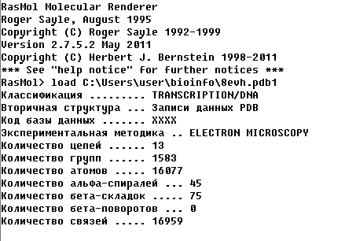

### Задание было сделано с помощью RasMol
#### Выбранная структура белка - https://www.rcsb.org/structure/8EVH

Чтобы выполнить задание нужно:
1) Скачать и установить программу
2) В командной строке программы выполнить команду " load *filepath* "
   
   Вот что вы увидете в командной строке
   
   
4) В соседнем окне появится модель вашего белка.

Теперь вы можете изменять визуализацию. За это отвечают 2 меню а именно "Вид" и "Цвет"
 

Ниже представлены различные конфигурации. 

- вид: каркас, цвет: хим. элемент(CPK)

- вид: связи, цвет: радикал

- вид: линии, цвет: индекс

- вид: атомы и связи, цвет: температура

- вид: Ван-дер-Ваальсов радиус, цвет: структура

- вид: скелет, цвет: цепь

- вид: молек. поверхность, цвет:

