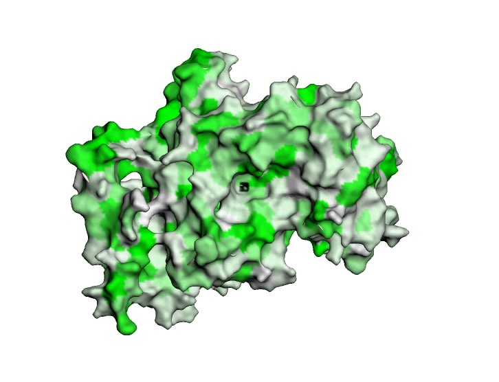
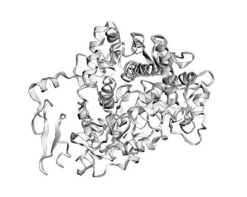
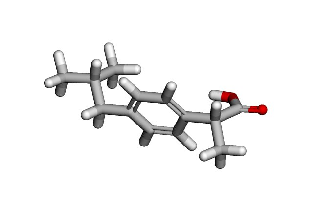
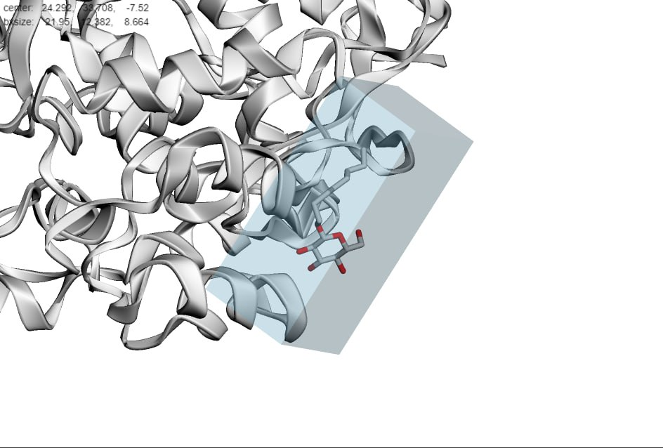
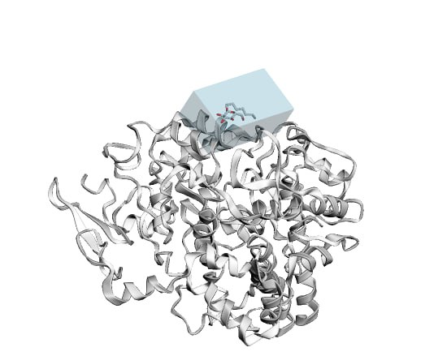
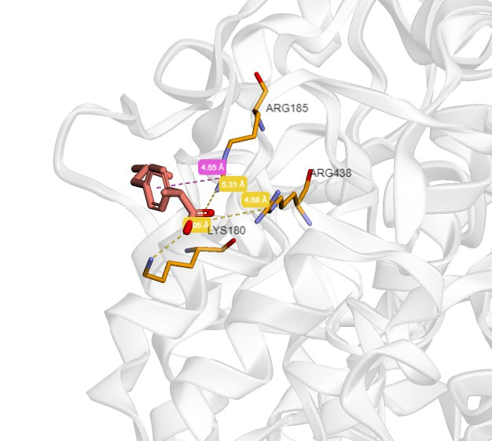
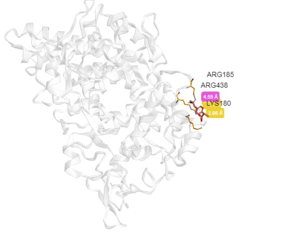

# задание 6
## Наименование препарата: Ибупрофен
### Основное действующее вещество - ибупрофен
#### Химическое название
(RS)-2-(4-(2-Метилпропил)фенил)пропановая кислота
#### Брутто формула
C13H18O2
#### Фармакологическая группа вещества Ибупрофен
НПВС — Производные пропионовой кислоты
### Область применения
НПВС, производное фенилпропионовой кислоты. Оказывает противовоспалительное, анальгезирующее и жаропонижающее действие.

Механизм действия связан с угнетением активности ЦОГ - основного фермента метаболизма арахидоновой кислоты, являющейся 
предшественником простагландинов, которые играют главную роль в патогенезе воспаления, боли и лихорадки. Анальгезирующее
действие обусловлено как периферическим (опосредованно, через подавление синтеза простагландинов), так и центральным
механизмом (ингибированием синтеза простагландинов в центральной и периферической нервной системе). 
Подавляет агрегацию тромбоцитов.

### Молекулярный механизм действия 
Неселективно ингибирует ЦОГ-1 и ЦОГ-2, уменьшает синтез ПГ. Противовоспалительный эффект связан с уменьшением 
проницаемости сосудов, улучшением микроциркуляции, снижением высвобождения из клеток медиаторов воспаления (ПГ, кинины,
ЛТ) и подавлением энергообеспечения воспалительного процесса. Анальгезирующее действие обусловлено снижением 
интенсивности воспаления, уменьшением выработки брадикинина и его альгогенности. При ревматоидном артрите влияет 
преимущественно на экссудативный и отчасти на пролиферативный компоненты воспалительной реакции, оказывает быстрое и 
выраженное обезболивающее действие, уменьшает отечность, утреннюю скованность и ограничение подвижности в суставах. 
Уменьшение возбудимости теплорегулирующих центров промежуточного мозга результируется в жаропонижающем действии. 
Выраженность антипиретического эффекта зависит от исходной температуры тела и дозы. При однократном приеме эффект 
продолжается до 8 ч. При первичной дисменорее уменьшает внутриматочное давление и частоту маточных сокращений. Обратимо
ингибирует агрегацию тромбоцитов.

Поскольку ПГ задерживают закрытие артериального протока после рождения, полагают, что подавление ЦОГ является основным 
механизмом действия ибупрофена при в/в применении у новорожденных с открытым артериальным протоком.

При приеме внутрь хорошо абсорбируется из ЖКТ. Cmax создается в течение 1 ч, при приеме после еды — в течение 1,5–2,5 ч.
Связывание с белками плазмы — 90%. Медленно проникает в полость сустава, но задерживается в синовиальной ткани, создавая
в ней большие концентрации, чем в плазме. Биологическая активность ассоциирована с S-энантиомером. После абсорбции около
60% фармакологически неактивной R-формы медленно трансформируется в активную S-форму. Подвергается биотрансформации. 
Известны 3 основных метаболита, выводимые почками. В неизмененном виде с мочой экскретируется не более 1%. Имеет 
двухфазную кинетику элиминации с T1/2 из плазмы 2–2,5 ч (для ретард форм — до 12 ч).

https://colab.research.google.com/drive/18F2vUBaFtcTfaFynxHcnV7cl3fwSwQk-?usp=sharing

### Структура подготовленного таргета

### Структура исходного лиганда

### Полученный бокс

### Полученный докинг

